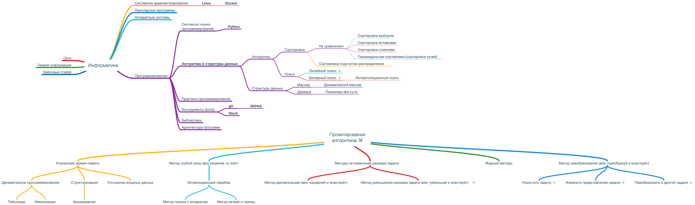

# Информатика 2019

Курс по информатике в Политехе.

## О чем курс

## Слайды

1. [Вводная лекция](https://korikov.cc/?d=2019-informatika-01-vvodnaya-lekciya) 

   - Как устроен курс.
   - Инфраструктура: slack, github, docker, linux. 
   - Курс молодого питониста.
   - *Дополнительно: элементарная комбинаторика, решето Эратосфена, линейный конгруэнтный метод.*

2. [Алгоритмы и структуры данных. Начало](https://korikov.cc/?d=2019-informatika-02-algoritmy-i-struktury-dannyh-nachalo)

   - Основные определения: алгоритм, АТД, структура данных, тип данных. 
   - Нужная математика: числовые ряды, О-большое, рекуррентные формулы.
   - Как сравнивать алгоритмы. 
   - Поиск: линейный, бинарный.
   - *Дополнительно: интерполяционный поиск, поиск прыжками, фиббоначивый поиск, экспоненциальный поиск.*

3. Проектирование алгоритмов ☠️ 

   - Метод грубой силы (aka решение «в лоб»).  Исчерпывающий перебор.
   - Метод преобразования (aka «преобразуй и властвуй»).
   - Жадные методы.
   - Метод уменьшения размера задачи (aka «уменьшай и властвуй»). Рекурсия.
   - Метод декомпозиции (aka «разделяй и властвуй»).
   - Компромис время-память. Динамическое программирование. Мемоизация.
   - Метод поиска с возвратом (aka backtracking).
   - Метод ветвей и границ (aka branch-and-bound).
   - *Дополнительно: алгоритм Карацубы, алгоритм Штрассена.*

4. АТД: линейные коллекции.

   - АТД список: непрерывные, односвязные, двусвязные.
   - Строка — список символов.
   - АТД очередь.
   - АТД стек и дека.

   - *Дополнительно: куча (aka пирамида),  очередь с приоритетом.*

## Практика

Задачи курса находятся [тут](tasks.md).
