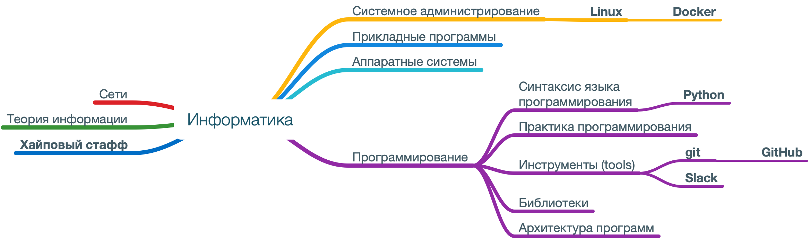

# Информатика 2019 🔥

Курс по информатике в Политехе.

## Содержание

- [О чем курс](#о-чем-курс)
- [Слайды](#слайды)
- [Практика](#практика)
- [Что уже прошли](#что-уже-прошли)
- [Известные алгоритмы и структуры данных в курсе](#известные-алгоритмы-и-структуры-данных-в-курсе)

## О чем курс

## Слайды

1. [Вводная лекция](https://korikov.cc/?d=2019-informatika-01-vvodnaya-lekciya)
- Как устроен курс.
- Инфраструктура: slack, github, docker, linux.
- Курс молодого питониста.
- *Дополнительно: элементарная комбинаторика, решето Эратосфена, линейный конгруэнтный метод.*

2. [Алгоритмы и структуры данных. Начало](https://korikov.cc/?d=2019-informatika-02-algoritmy-i-struktury-dannyh-nachalo)
- Основные определения: алгоритм, АТД, структура данных, тип данных. 
- Нужная математика: числовые ряды, О-большое, рекуррентные формулы.
- Как сравнивать алгоритмы. 
- Поиск: линейный, бинарный.
- *Дополнительно: интерполяционный поиск, поиск прыжками, фибоначчиев поиск, экспоненциальный поиск.*

3. [Проектирование алгоритмов](https://korikov.cc/?d=2019-informatika-03-proektirovanie-algoritmov) ☠️
- Метод грубой силы (aka решение «в лоб»).  Исчерпывающий перебор. Метод поиска с возвратом, ветвей и границ.
- Метод преобразования (aka «преобразуй и властвуй»).
- Жадные методы.
- Метод уменьшения размера задачи (aka «уменьшай и властвуй»). Рекурсия.
- Метод декомпозиции (aka «разделяй и властвуй»).
- Компромисс время-память. Динамическое программирование. Мемоизация.
- *Дополнительно: сортировка Шелла, сортировка пузырьком, быстрая сортировка, порядковые статистики, radix-сортировка.*

4. [АТД с линейным порядком](https://korikov.cc/?d=2019-informatika-04-atd-s-lineinym-poryadkom)
- АТД список.
- Строка — список символов.
- АТД очередь. Стек и дек. Очередь с приоритетом.
- Структуры: массив, связный список, список с пропусками.
- *Дополнительно: куча (aka пирамида).*

5. [Бонус: программирование, IT и рок-н-ролл 🎸](https://korikov.cc/?d=2019-informatika-05-bonus-programmirovanie-it-i-roknroll)
- Парадигмы программирования.
- Типизация.
- Компиляторы и интерпретаторы.

6. [Бонус: ООП, функциональное программирование, TDD и чистый код](https://korikov.cc/?d=2019-informatika-06-bonus-oop-funkcionalnoe-programmirovanie-tdd-i-chistyi-kod)
- Объектно-ориентированное программирование, SOLID, паттерны.
- Чистые функции, высшие функции.
- Разработка через тестирование (TDD).
- Рекомендации.

7. [Бонус: планирование в IT](https://korikov.cc/?d=2019-informatika-07-bonus-planirovanie-v-it)
- Водопадная модель, Agile, Scrum, канбан-доска.
- Максим Дорофеев и игры.

8. [АТД: словарь и множество](https://korikov.cc/?d=2019-informatika-08-atd-slovar-i-mnojestvo)
- АТД словарь и АТД множество, мультимножество.
- Хэш-таблица. Хэширование. Разрешение коллизий.
- Алгоритм Рабина-Карпа.
- Словарь и множество в Python.
- *Дополнительно: фильтр Блума.*

9. [АТД: дерево ☠️](https://korikov.cc/?d=2019-informatika-09-atd-derevo)
- АТД дерево
- Реализация деревьев
- Бинарное дерево
- Бинарное дерево поиска
- Сбалансированные деревья: АВЛ-дерево, RB-дерево, 2-3-дерево, B-дерево
- *Дополнительно: splay-дерево, k-d дерево, scapegoat-дерево*.

10. [Графы: карта злачных мест Петербурга. 18+](https://korikov.cc/?d=2019-informatika-10-grafy-karta-zlachnyh-mest-peterburga-18)
- АТД граф
- Обход графа
- Топологическая сортировка
- Кратчайшие пути
- Минимальное остовое дерево
- Задача о максимальном потоке
- Задача коммивояжера

11. [Числа в компьютере](https://korikov.cc/?d=2019-informatika-11-chisla-v-komputere)
- Как работает компьютер 
- Как биты превращаются в числа
- *Дополнительно: алгоритм Евклида, алгоритм Карацубы, алгоритм Штрассена, метод Ньютона, Алгоритм численного дифференцирования*.

12. [Конкурентное программирование](https://korikov.cc/?d=2019-informatika-12-elementy-konkurentnogo-programmirovaniya)
- Parallelism != Concurrency 
- Threads и processes 
- Синхронизация 
- Actors 
- GPU: параллелизм данных 
- Лямбда-архитектура

### Что не вошло в курс и предлагается для самостоятельного изучения:

- Машинное обучение: решающие деревья, нейронные сети, обучение с подкреплением, уменьшение размерности.
- NP-задачи и эвристики
- Квантовые алгоритмы ☠️ 

## Практика

Задачи курса находятся [тут](tasks.md).

## Что уже прошли?

## Известные алгоритмы и структуры данных в курсе

- 2-3 дерево [см. [тема 9](https://korikov.cc/?d=2019-informatika-09-atd-derevo)]
- Radix-сортировка
- Scapegoat-дерево [см. [тема 9](https://korikov.cc/?d=2019-informatika-09-atd-derevo)]
- Splay-дерево [см. [тема 9](https://korikov.cc/?d=2019-informatika-09-atd-derevo)]
- k-d дерево [см. [тема 9](https://korikov.cc/?d=2019-informatika-09-atd-derevo)]
- АВЛ-дерево [см. [тема 9](https://korikov.cc/?d=2019-informatika-09-atd-derevo)]
- Алгоритм Белмана-Форда
- Алгоритм Бойера-Мура
- Алгоритм Дейкстры [см. [тема 10](https://korikov.cc/?d=2019-informatika-10-grafy-karta-zlachnyh-mest-peterburga-18)]
- Алгоритм Евклида
- Алгоритм Карацубы
- Алгоритм Кнута-Морриса-Пратта
- Алгоритм Крускала [см. [тема 10](https://korikov.cc/?d=2019-informatika-10-grafy-karta-zlachnyh-mest-peterburga-18)]
- Алгоритм Прима [см. [тема 10](https://korikov.cc/?d=2019-informatika-10-grafy-karta-zlachnyh-mest-peterburga-18)]
- Алгоритм Рабина-Карпа [см. [тема 8](https://korikov.cc/?d=2019-informatika-08-atd-slovar-i-mnojestvo)]
- Алгоритм Флойда
- Алгоритм Штрассена
- Бинарный поиск [см. [тема 2](https://korikov.cc/?d=2019-informatika-02-algoritmy-i-struktury-dannyh-nachalo)]
- Быстрая сортировка [см. [тема 3](https://korikov.cc/?d=2019-informatika-03-proektirovanie-algoritmov)]
- Граф [см. [тема 10](https://korikov.cc/?d=2019-informatika-10-grafy-karta-zlachnyh-mest-peterburga-18)]
- Дек [см. [тема 4](https://korikov.cc/?d=2019-informatika-04-atd-s-lineinym-poryadkom)]
- Интерполяционный поиск [см. [тема 2](https://korikov.cc/?d=2019-informatika-02-algoritmy-i-struktury-dannyh-nachalo)]
- Код Хаффмана [см. [тема 9](https://korikov.cc/?d=2019-informatika-09-atd-derevo)]
- Код Хэмминга
- Кольцевая очередь
- Красно-черное дерево [см. [тема 9](https://korikov.cc/?d=2019-informatika-09-atd-derevo)]
- Куча (aka пирамида) [см. [тема 4](https://korikov.cc/?d=2019-informatika-04-atd-s-lineinym-poryadkom), [тема 3](https://korikov.cc/?d=2019-informatika-03-proektirovanie-algoritmov)]
- Линейный конгруэнтный метод [см. [тема 1](https://korikov.cc/?d=2019-informatika-01-vvodnaya-lekciya)]
- Линейный поиск [см. [тема 2](https://korikov.cc/?d=2019-informatika-02-algoritmy-i-struktury-dannyh-nachalo)]
- Массив [см. [тема 4](https://korikov.cc/?d=2019-informatika-04-atd-s-lineinym-poryadkom)]
- Обход дерева в глубину (DFS) [см. [тема 9](https://korikov.cc/?d=2019-informatika-09-atd-derevo)]
- Обход дерева в ширину (BFS) [см. [тема 9](https://korikov.cc/?d=2019-informatika-09-atd-derevo)]
- Очередь [см. [тема 4](https://korikov.cc/?d=2019-informatika-04-atd-s-lineinym-poryadkom)]
- Очередь с приоритетом [см. [тема 4](https://korikov.cc/?d=2019-informatika-04-atd-s-lineinym-poryadkom)]
- Пирамидальная сортировка (сортировка кучей) [см. [тема 3](https://korikov.cc/?d=2019-informatika-03-proektirovanie-algoritmov)]
- Поиск прыжками [см. [тема 2](https://korikov.cc/?d=2019-informatika-02-algoritmy-i-struktury-dannyh-nachalo)]
- Префиксное дерево 
- Решето Эратосфена [см. [тема 1](https://korikov.cc/?d=2019-informatika-01-vvodnaya-lekciya)]
- Связный список [см. [тема 4](https://korikov.cc/?d=2019-informatika-04-atd-s-lineinym-poryadkom)]
- Сортировка Шелла [см. [тема 3](https://korikov.cc/?d=2019-informatika-03-proektirovanie-algoritmov)]
- Сортировка вставкой [см. [тема 3](https://korikov.cc/?d=2019-informatika-03-proektirovanie-algoritmov)]
- Сортировка выбором [см. [тема 3](https://korikov.cc/?d=2019-informatika-03-proektirovanie-algoritmov)]
- Сортировка кучей (пирамидой) [см. [тема 3](https://korikov.cc/?d=2019-informatika-03-proektirovanie-algoritmov)]
- Сортировка пузырьком [см. [тема 3](https://korikov.cc/?d=2019-informatika-03-proektirovanie-algoritmov)]
- Сортировка слиянием [см. [тема 3](https://korikov.cc/?d=2019-informatika-03-proektirovanie-algoritmov)]
- Суффиксное дерево
- Топологическая сортировка [см. [тема 10](https://korikov.cc/?d=2019-informatika-10-grafy-karta-zlachnyh-mest-peterburga-18)]
- Фибоначчиев поиск [см. [тема 2](https://korikov.cc/?d=2019-informatika-02-algoritmy-i-struktury-dannyh-nachalo)]
- Фильтр Блума
- Хэш-таблица [см. [тема 8](https://korikov.cc/?d=2019-informatika-08-atd-slovar-i-mnojestvo)]
- Экспоненциальный поиск [см. [тема 2](https://korikov.cc/?d=2019-informatika-02-algoritmy-i-struktury-dannyh-nachalo)]

#### Что не успели рассмотреть
- Kadane's algorithm
- Q-learning
- Фильтр Калмана
- SVD-разложение
- Симплекс-метод
- Система непересекающихся множеств
- Схема Горнера
- Метод t-SNE
- Метод Монте-Карло
- Метод Ньютона
- Градиентный спуск
- Алгоритм kNN
- Алгоритм A*
- Алгоритм PCA
- Алгоритм PageRank
- Алгоритм QR
- Алгоритм k-mean
- Алгоритм Шора
- Алгоритм обратного распространения ошибки
- Алгоритм численного дифференцирования
